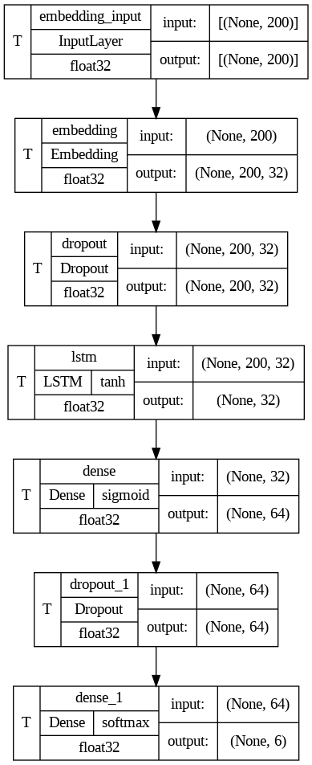

# Text Emotion Classification Application

A text emotion classification application that detects emotions joy, sadness, anger, surprise, fear, and love using Logistic Regression.


## Table of Contents
1. [Introduction](#introduction)
2. [Used Technologies](#used-technologies)
3. [Dataset Preparation](#dataset-preparation)
4. [Model Training and Algorithms](#model-training-and-algorithms)
5. [Usage](#usage)

## Introduction
This application classifies text into one of six emotions: joy, sadness, anger, surprise, fear, and love. The primary model used is Logistic Regression, but other models, including Multinomial Naive Bayes, CNN, and RNN, were also tested for comparison. The dataset used is the "Emotion Dataset for NLP" from Kaggle, containing 40,000 labeled texts.

## Used Technologies
- **Programming Language:** Python
- **Libraries:** NumPy, Pandas, Scikit-learn, nltk, TensorFlow, Streamlit
- **Dataset:** [Emotion Dataset for NLP](https://www.kaggle.com/datasets/praveengovi/emotions-dataset-for-nlp)
- **Visualization:** Matplotlib, Seaborn, WordCloud

## Dataset Preparation
The dataset used in this project is sourced from Kaggle and contains 40,000 texts labeled with six emotions. Initially divided into separate files for training, validation, and testing, all data was combined into a single dataset [text_emotions.csv](data/text_emotions.csv). For each emotion, a WordCloud was generated to visualize the most common words associated with that emotion.


## Model Training and Algorithms
### Machine Learning Models
#### 1. Multinomial Naive Bayes
Mathematical formulas:
- **Class Prior:** $$\\log P(c) = \log \frac{\text{count}(c)}{N}\$$
- **Feature Log Probabilities:** $$\\log P(x_i|c) = \log \frac{\text{count}(x_i, c) + \alpha}{\sum_j (\text{count}(x_j, c) + \alpha)}\$$
- **Prediction:** $$\\hat{y} = \arg\max_c \left( \log P(c) + \sum_i x_i \log P(x_i|c) \right)\$$

Implementation: [MultinomialNB.py](models/MultinomialNB.py)

#### 2. Logistic Regression
Mathematical formulas:
- **Sigmoid Function:** $$\\sigma(z) = \frac{1}{1 + e^{-z}}\$$
- **Logistic Regression Model:** $$y = \sigma(\mathbf{w}^T \mathbf{x} + b)\$$
- **Loss Function (Binary Cross-Entropy):** $$L(y, \hat{y}) = -\frac{1}{m} \sum_{i=1}^m \left[ y_i \log(\hat{y}_i) + (1 - y_i) \log(1 - \hat{y}_i) \right]\$$

Implementation: [LogisticRegression.py](models/LogisticRegression.py)

### Text Vectorization Methods
- **TF-IDF Vectorization**
  - Multinomial Naive Bayes accuracy: 0.67
  - Logistic Regression accuracy: 0.84
  - SVM accuracy: 0.82

- **Count Vectorization**
  - Multinomial Naive Bayes accuracy: 0.77
  - Logistic Regression accuracy: 0.85
  - SVM accuracy: 0.81

### Deep Learning Models
#### 1. Convolutional Neural Network (CNN)
- **Architecture:**
  - Embedding Layer: Input dimension 15,000, output dimension 32, input length 200
  - Conv1D: 64 filters, kernel size 3, ReLU activation
  - BatchNormalization, ReLU, Dropout (0.2)
  - GlobalMaxPooling1D
  - Dense: 128 units, ReLU activation, Dropout (0.3)
  - Dense: 6 units, softmax activation
   

- **Accuracy:** 0.9747

#### 2. Recurrent Neural Network (RNN) with LSTM
- **Architecture:**
  - Embedding Layer: Input dimension 15,000, output dimension 32, input length 200
  - Dropout (0.2)
  - LSTM: 32 units
  - Dense: 64 units, sigmoid activation, Dropout (0.2)
  - Dense: 6 units, softmax activation
    

- **Accuracy:** 0.3205

## Usage
To run the application, follow these steps:
1. **Prepare the Dataset:** Ensure the dataset file (`data/text_emotions.csv`) is in place.
2. **Train the Models:** Use the provided notebook (`data/TextEmotionClassification.ipynb`) to train the models. You can customize the models as needed.
3. **Download Model Files:** After training, download the pickle files of the label encoder, vectorizer, and model.
4. **Run the Application:** 
    - Run the application using:
     ```sh
     streamlit run app.py
     ```
